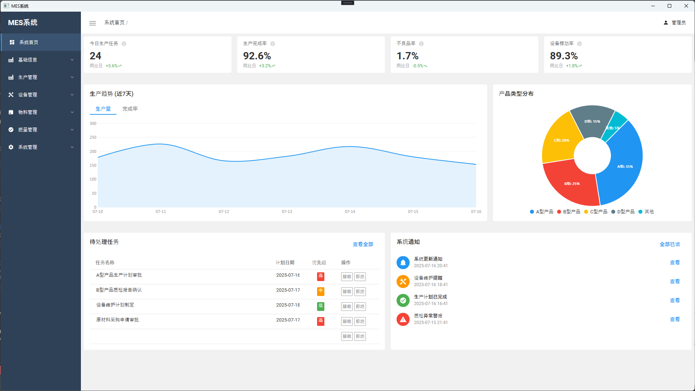
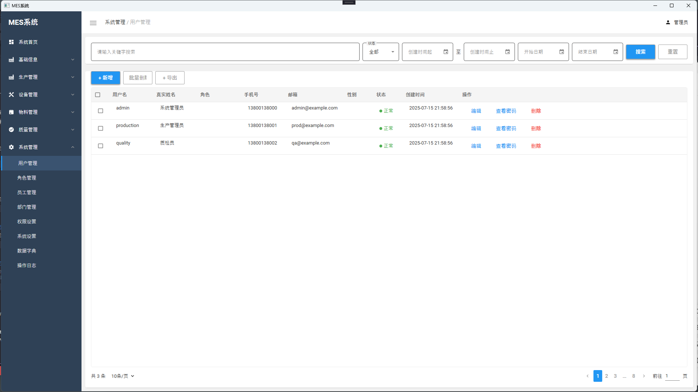
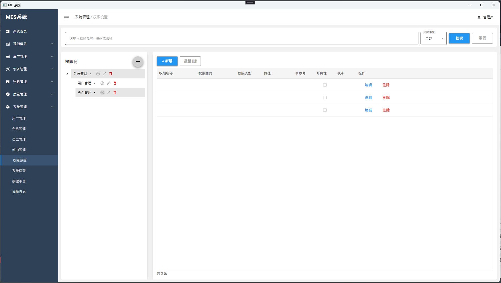
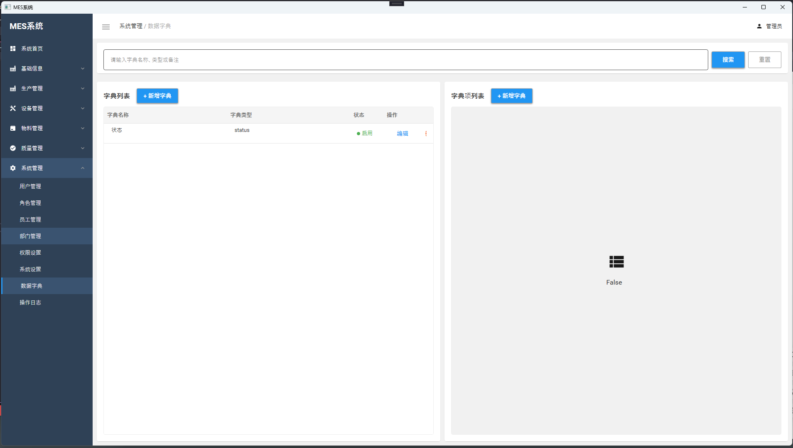

# MES_WPF - 制造执行系统

MES_WPF是一个基于WPF开发的现代化制造执行系统(Manufacturing Execution System)，旨在帮助制造企业实现生产过程的数字化、可视化管理。

## 项目概述

本系统采用MVVM（Model-View-ViewModel）架构模式开发，使用了MaterialDesign设计风格，提供了直观、美观的用户界面，帮助用户高效管理生产过程。

模仿Element-Plus的界面生成的WPF,由于这是我的初次尝试WPF，之前一直是使用Winform,整体代码还是存在很多问题，


首页



用户管理，大部分管理模块都是按照此页面的样式去设计



新增/修改的弹窗样式


权限管理




数据字典




## 主要功能

- **仪表盘**：显示关键生产指标、生产趋势图表、产品类型分布、任务列表和系统通知
- **生产计划管理**：制定、调整和跟踪生产计划
- **设备监控**：实时监控设备运行状态和稼动率
- **质量管理**：跟踪和分析产品质量数据
- **任务分配与跟踪**：分配生产任务并跟踪完成情况
- **系统通知**：重要事件的实时通知和提醒

## 技术栈

- **开发平台**：.NET 8.0
- **UI框架**：WPF (Windows Presentation Foundation)
- **架构模式**：MVVM (Model-View-ViewModel)
- **UI组件库**：MaterialDesign
- **图表库**：LiveCharts
- **MVVM框架**：CommunityToolkit.Mvvm

## 系统要求

- Windows 7/8/10/11
- .NET Framework 4.6.1或更高版本

## 开发环境设置

1. 安装Visual Studio 2019或更高版本
2. 确保安装了".NET桌面开发"工作负载
3. 克隆本仓库
4. 打开解决方案文件 (MES_WPF.sln)
5. 还原NuGet包
6. 编译并运行项目

## 项目结构

```

```

## 功能展示

### 仪表盘
仪表盘页面提供了生产关键指标的可视化展示，包括：
- 今日生产任务完成情况
- 生产完成率
- 不良品率
- 设备稼动率
- 近7天生产趋势图
- 产品类型分布饼图
- 待处理任务列表
- 系统通知列表


## 许可证

[MIT](LICENSE)

## 联系方式

如有任何问题或建议，请通过以下方式联系我们：
- 项目主页：[https://github.com/baitianbt/MES_WPF]
- 电子邮件：[1749492810@qq.com]